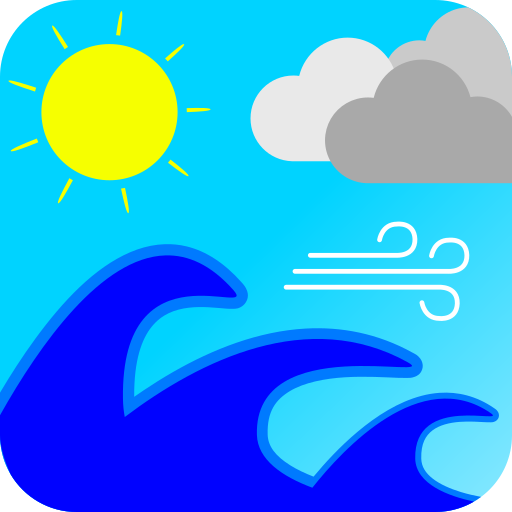
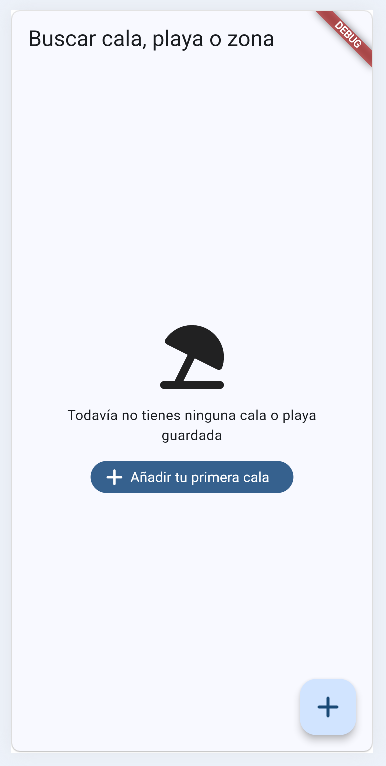
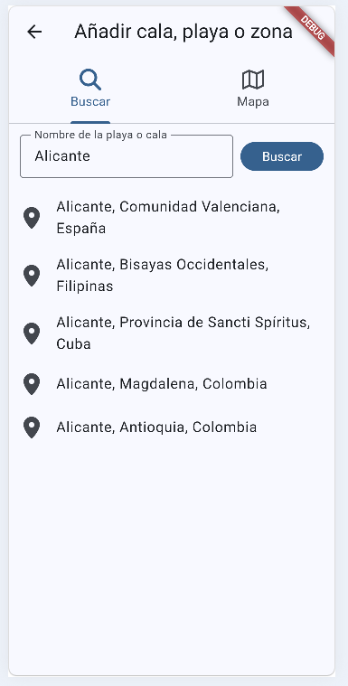
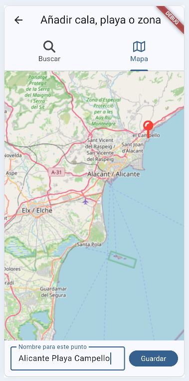
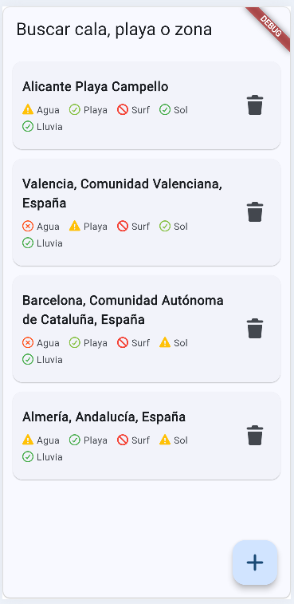
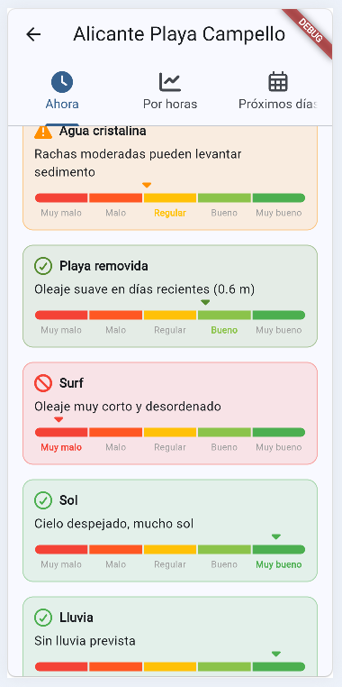
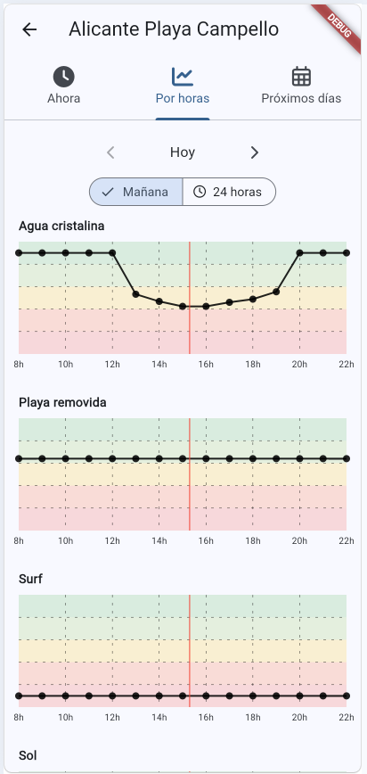
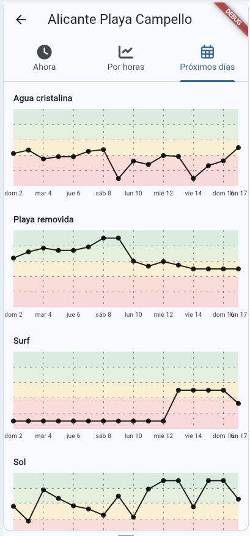
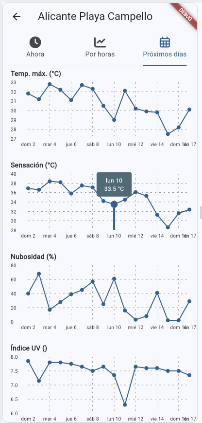
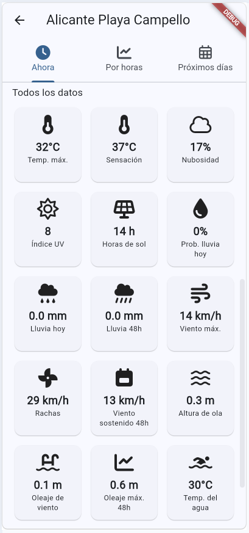

# Sea Weather

<p align="center">
    
</p>

<p align="center">
    <a href="#setup">Setup</a> ·
    <a href="#ejecutar">Ejecutar</a> ·
    <a href="#build">Build</a> ·
    <a href="#capturas">Capturas</a> ·
    <a href="#menciones-honorables">Menciones honorables</a>
</p>

Consulta el tiempo y el estado del mar en tus playas y calas favoritas. Cuenta con 5 indicadores sencillos para informar sobre si es visible el fondo marino en la playa, si es buena para surfear, si está bien para ir a la playa, si hay suficiente sol y cuánto viento hay.

Esta aplicación es un proyecto personal, sin ánimo de ofrecer soporte ni garantías. A diferencia de otras apps de tiempo, su objetivo es simplificar la decisión de "¿hoy es buen día para ir a la playa?" reduciéndola a 5 indicadores claros, en vez de mostrar montones de datos meteorológicos y marinos que hay que interpretar uno mismo.

## Setup

Las carpetas nativas (`android/`, `windows/`, `web/`, ...) no están en el repo — se generan localmente:

```
flutter pub get
flutter create --platforms=android,windows --org es.abderra .
dart run flutter_launcher_icons
```

Esto solo hace falta la primera vez (o si borras esas carpetas de nuevo). El último comando regenera el icono de la app (`.github/images/logo.png`) en las carpetas nativas, ya que `flutter create` las deja con el icono por defecto de Flutter.

## Ejecutar

```
flutter run -d windows
flutter run -d chrome
flutter run -d <id-del-dispositivo-android>
```

## Build

```
flutter build windows
flutter build web
flutter build apk
```

## Capturas

<p align="center">
    
    
    
    
    
    
    
    
    
</p>

## Menciones honorables

- [Open-Meteo](https://open-meteo.com/) — previsión meteorológica, marina y geocoding, gratis y sin necesidad de API key.
- [OpenStreetMap](https://www.openstreetmap.org/) — datos y tiles del mapa.
